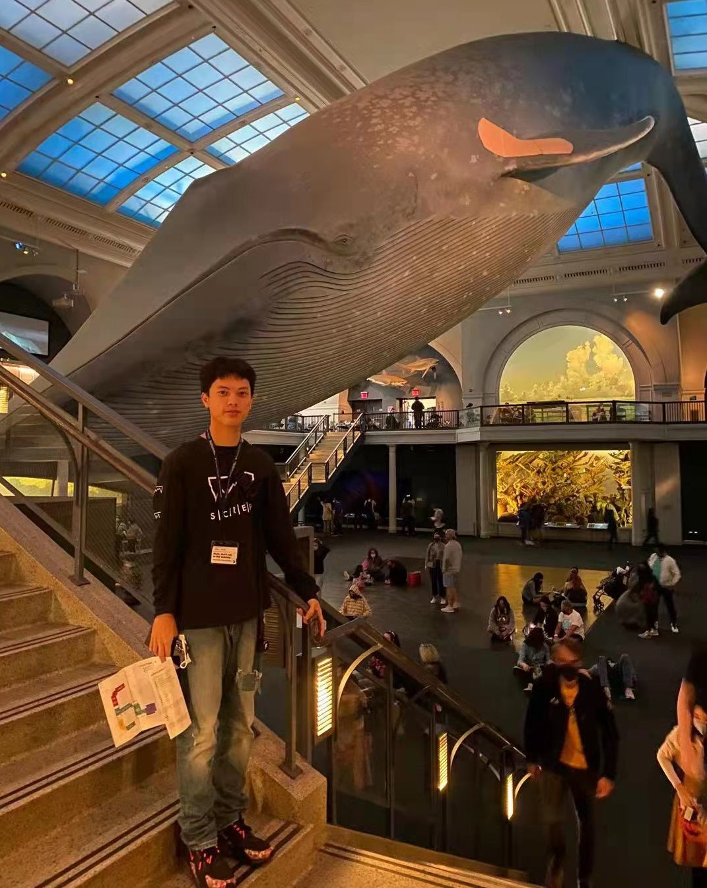

<link rel="stylesheet" href="academicons.css"/>
<link rel="stylesheet" href="styles.css" type="text/css">

#### First-year student in MS Biostatistics
#### Columbia University, Mailman School of Public Health

  

I obtained a BS in Statistics from [Shanghai University of Finance and Economics](https://english.sufe.edu.cn/) in 2021 and I am currenly pursuing a MS in Biostatistics (Data Science Track) from [Columbia University](https://www.mailman.columbia.edu/become-student/departments/biostatistics). My undergraduate dissertation was advised by [FengXin Dong](https://ssm.sufe.edu.cn/31/13/c716a143635/page.htm) and focused on sentiment classification of text data during COVID19. I love Data Science and my career goal is to help adapt Data Science in healthcare industry. Now I am actively looking for **2022 summer internship** and **reseach assistant** related to Data Science/Public Health.

 

#### Contact Information

[Department of Biostatistics](http://www.mailman.columbia.edu/academic-departments/biostatistics)  
[Columbia Mailman School of Public Health](http://www.mailman.columbia.edu/)  
100 Haven Ave
 
New York, New York 10032  

Email: [zheyan.liu@columbia.edu](mailto:zheyan.liu@columbia.edu)  